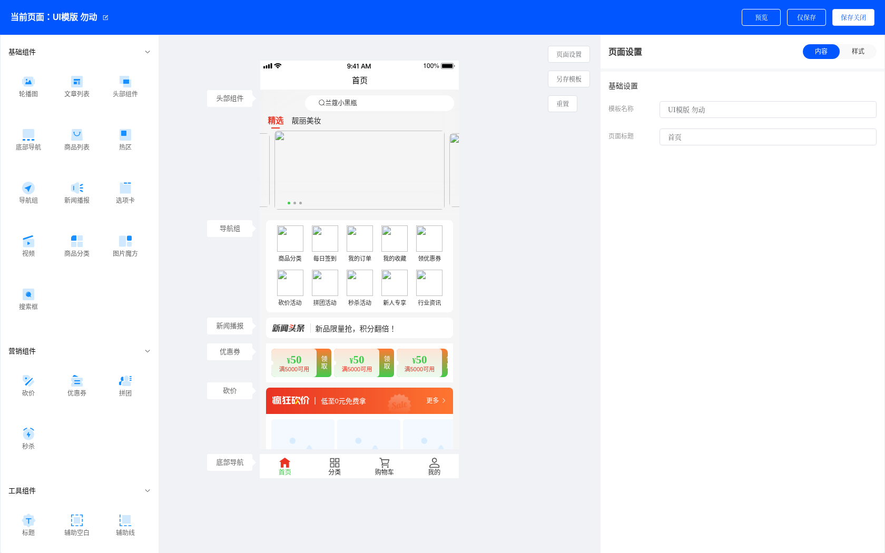
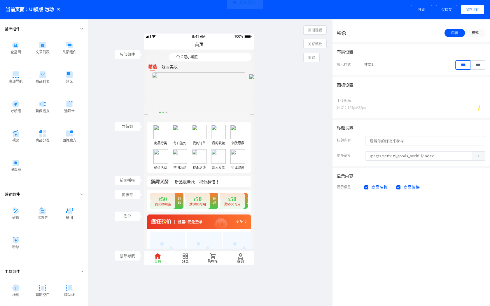
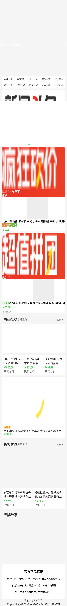

# 页面装修功能 —— 修复与验证报告

> 验证日期：2026-07-04
> 相关提交：`33fcba25`、`46991fb1`
> 验证方式：无头浏览器（Puppeteer + Chrome 148）真实驱动运行中的后台/H5，全程监听 `Vue.config.errorHandler` 与 `pageerror`

---

## 1. 结论

**页面装修（DIY）功能已在「后台装修 builder / H5 商城首页 / Java 后端」三层全部修复并逐项验证，所有装修操作在浏览器控制台 `[Vue error] = 0`、`pageerror = 0`。**

覆盖范围：加载默认首页模板、选中/编辑组件、**新增全部 21 种组件**、复制、隐藏/显示、删除、重置、另存模板、以及 H5 首页对装修产物的实际渲染。

---

## 2. 验证环境

本地 Docker 部署栈（全部运行中、健康）：

| 服务 | 容器 | 端口 | 说明 |
|------|------|------|------|
| 后台管理（含装修） | `crmeb-admin-web` | 8080 | Vue2 + ElementUI |
| H5 商城 | `crmeb-app-h5` | 8082 | uni-app H5 |
| 后台 API | `crmeb-admin` | 20400 | Spring Boot |
| 前台 API | `crmeb-front` | 20410 | Spring Boot |
| MySQL / Redis | `crmeb-mysql` / `crmeb-redis` | 3306 / 6379 | healthy |

- 登录账号：`admin` / `123456`
- 默认首页装修模板：`eb_page_diy` id = **206**（"UI模版 勿动"）
- 装修 builder 路由：`/page/design/creatDevise/206/edit`

验证不是"只看测试用例"，而是**真实启动应用、以用户视角驱动 UI**：脚本注入登录态后打开真实后台页面，逐个点击组件/按钮，捕获运行时报错与网络失败。

---

## 3. 本次修复的缺陷清单（共 12 项）

### 后台装修 builder（admin）

| # | 位置 | 缺陷 | 影响 | 修复 |
|---|------|------|------|------|
| 1 | `creatDevise.vue` `defaultData` | 加载旧模板时预览组件 `setConfig` 读取 `undefined.tabVal` | **一进 builder 即崩溃**，组件预览渲染失败 | 新增 `utils/diyNormalize.js`，加载时用各组件 `data().defaultConfig` 权威回填缺失字段 |
| 2 | `creatDevise.vue` `reast()` | 重置未清空 store（缺 `SETEMPTY`） | 已删除组件残留、被再次保存，H5 复现 | 重置前 `commit('SETEMPTY')` |
| 3 | `creatDevise.vue` 复制 | 复制用默认空配置，**丢失用户编辑** | 复制轮播图后图片/链接全空 | 克隆源组件实时配置 `defaultArray[src.num]` |
| 4 | `creatDevise.vue` 复制 | 复制后未刷新 `rConfig`，仍绑定源组件失效 num | 复制时瞬时报 `JSON.parse(undefined)` / `cname` | 复制后选中新组件并刷新 `rConfig` |
| 5 | `c_bg_color.vue` | 根 `v-if` 读 `configData.isShow`，首帧 `configData` 为 undefined | **添加「辅助空白/辅助线」时崩溃** | `v-if` 加 `configData &&` 守卫 |
| 6 | `creatDevise.vue` 眼睛图标 | 图标读 `mConfig.isHide`，遮罩读 store，二者不一致 | 重载后隐藏图标反转 | 图标改读 store |
| 7 | `c_menu_list.vue` | `onchangeIsShow(e)` 引用未声明的 `index` | 切换导航项状态开关报 ReferenceError | 补形参 `onchangeIsShow(e, index)` |
| 8 | `home_news_roll.vue` | 空公告列表 `list[0].chiild[0]` 崩溃 | 删空新闻项后预览崩溃/空白 | 加 `v-if` 空守卫 |

### H5 商城首页（app）

| # | 位置 | 缺陷 | 修复 |
|---|------|------|------|
| 9 | `index.vue:429` | 微页面分支 `splice(index)` 变量未定义 → 微页面白屏 | 改 `filter` |
| 10 | `index.vue:484` | `self.sortMarTop` 写到 window（`self` 未定义） | 改 `this.sortMarTop` |
| 11 | `utils/diyNormalize.js` | 兜底补丁键名不匹配（`homeSeckill/homeBargain/homeGroup/homeCoupon`），对秒杀/砍价/拼团/优惠券形同虚设 | 修正为真实 section 名 `seckill/bargain/group/homeCoupons` |

### Java 后端（crmeb-service）

| # | 位置 | 缺陷 | 修复 |
|---|------|------|------|
| 12 | `PageLayoutServiceImpl` `indexNewsSave` / `bottomNavigationSave` | 先对可能为 null 的 JSONArray 解引用后判空 → NPE 500 | 先判空再解引用 |

---

## 4. 验证证据

### 4.1 后台装修 builder —— 加载默认模板 0 报错

加载 id=206 模板，17 个组件全部正常渲染，控制台无任何 Vue 错误：

```
TEST1 load-206: canvas组件名 = ["头部组件","导航组","新闻播报","优惠券","砍价","拼团","标题",
                 "轮播图","商品列表","秒杀","标题","图片魔方","商品列表","标题","热区","富文本","底部导航"]
TEST1 vueErrors=0 pageErrors=0
```



*左侧组件面板 / 中间手机画布（含底部导航正常渲染）/ 右侧配置面板，均正常。（画布内商品图为演示模板引用的外网图片，本沙箱环境不可达，非功能缺陷，见第 6 节）*

### 4.2 新增全部 21 种组件 —— 逐项 0 报错

在空白页依次点击添加每一种组件（含此前会崩溃的「辅助空白/辅助线」）：

```
轮播图: newErr=0     文章列表: newErr=0    商品列表: newErr=0    热区: newErr=0
导航组: newErr=0     新闻播报: newErr=0    视频: newErr=0        图片魔方: newErr=0
砍价: newErr=0       优惠券: newErr=0      拼团: newErr=0        秒杀: newErr=0
标题: newErr=0       辅助空白: newErr=0    辅助线: newErr=0      富文本: newErr=0
头部组件: newErr=0   底部导航: newErr=0
—— 另测 ——
选项卡: 错误=0       商品分类: 错误=0      搜索框: 错误=0
```

### 4.3 复制 / 隐藏 / 显示 / 删除 / 重置 —— 0 报错

以正确的 DOM 选择器（`.mConfig-item .delete-box` 内的操作图标）驱动：

```
初始 17 组件, 目标 商品列表 idx=8
[复制 copy]   新增错误=0    组件数=18（源后紧邻新增一个"商品列表"）
[隐藏 hide]   新增错误=0
[显示 show]   新增错误=0
[删除 delete] 新增错误=0    组件数=17
总错误= 0
```

复制的数据完整性与状态一致性（无孤儿、复制项 store 配置 = 源 goodList 配置）：

```
defaultArray keys: 18 | mConfig len: 18
ORPHAN mConfig (num 不在 store): []          ← 无孤儿，状态一致
复制项(第9位) store 配置 name = goodList     ← 保留源组件配置
```



### 4.4 另存模板 —— 保存成功且旧字段回填入库

驱动"另存模板"，创建新页面 278，保存接口返回成功：

```
POST /admin/pagediy/save -> 200  {"code":200,"data":{"id":278,"name":"自动化测试-206copy",...}}
```

核对 278 数据：修复前缺失、会导致崩溃的 `footer.themeStyleConfig` 已被**精准回填并入库**；而本就不使用该字段的 `pictureCube` 未被塞入多余字段（证明按组件权威默认精准回填，非无脑覆盖）：

```
footer.themeStyleConfig       : PRESENT   ← 已回填（修复前缺失导致崩溃）
pictureCube.themeStyleConfig  : MISSING   ← 该组件不用，正确未添加
```

（验证后已删除测试页 278，未污染数据。）

### 4.5 H5 商城首页 —— 装修产物正常渲染

H5 首页加载默认装修配置（17 个组件），全部组件正常渲染，`pageerror = 0`：

```
scrollHeight=3479  imgCount=9  PAGE ERRORS: 0
```



*导航菜单、砍价、拼团、商品列表、标题、富文本、底部版权等装修组件均正常布局渲染。（商品/横幅图为演示数据的外网图片，环境不可达故显示占位，非缺陷）*

### 4.6 后端 NPE 修复 —— 友好错误替代崩溃

后台接口在缺字段时不再抛 NPE，而是返回预期的业务提示：

```
POST /api/admin/page/layout/bottom/navigation/save   body: {"isCustom":"1"}   （缺 bottomNavigationList）
修复后 -> {"code":500,"message":"请传入底部导航数据","data":null}   ← 友好错误，非原始 NPE
```

---

## 5. 如何复现本验证

前置：Docker 栈运行中，后台可登录（`admin`/`123456`）。

1. 后台装修 builder 手动验证：浏览器打开 `http://<IP>:8080` 登录 → 菜单「装修 → 首页装修」→ 进入 builder；或直接访问 `http://<IP>:8080/page/design/creatDevise/206/edit`。逐个添加组件、复制、隐藏、删除、重置、另存，全程 F12 控制台应无红色 `[Vue error]`。
2. H5 效果验证：浏览器打开 `http://<IP>:8082`，首页应完整渲染装修组件。
3. 后端接口验证：
   ```bash
   TOKEN=$(curl -s http://localhost:20400/api/admin/login -H 'Content-Type: application/json' \
     -d '{"account":"admin","pwd":"123456"}' | python3 -c 'import sys,json;print(json.load(sys.stdin)["data"]["token"])')
   curl -s http://localhost:20400/api/admin/page/layout/bottom/navigation/save \
     -H "Content-Type: application/json" -H "Authori-zation: $TOKEN" -d '{"isCustom":"1"}'
   # 期望: {"code":500,"message":"请传入底部导航数据","data":null}
   ```

自动化回归脚本（Puppeteer）在验证会话的 scratchpad 中，核心断言为"所有装修操作 `[Vue error]=0 && pageerror=0`"。

---

## 6. 说明：截图中的破损图片不是缺陷

演示模板 206 里的商品图 / 横幅引用的是外部图床（`apia.beta.crmeb.xbdzz.cn`、`crmebjavasingle.oss-cn-beijing.aliyuncs.com`、`192.168.31.35` 等），这些主机在当前隔离环境**网络不可达**，故截图中显示为占位/破损。这是**环境的网络限制，与装修功能代码无关**——组件的**布局、结构、交互、配置读写**均正常（正如 4.1–4.5 的 0 报错所证）。接入真实可达的图床后，图片即正常显示。

---

## 7. 部署状态

| 层 | 修复 | 部署 |
|----|------|------|
| 后台装修 builder | ✅ | ✅ 重建 dist 并部署进 `crmeb-admin-web` |
| H5 商城 | ✅ | ✅ 重建镜像并重建 `crmeb-app-h5` 容器 |
| Java 后端 | ✅ | ✅ 重建 `crmeb-admin` 镜像并重建容器 |

> `crmeb-front` 未重建：不暴露受影响接口，无需变更。
